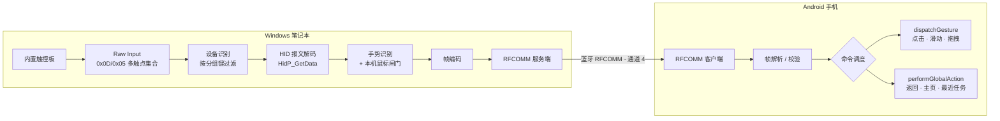

# TrackLink

用笔记本的**内置触控板**远程操控 Android 手机。

手指在触控板上滑动、轻点、双指滚动、三指横扫，手机端就完成对应的点击、滚动、返回与回桌面操作。整条链路只走**已配对的蓝牙链路**，不依赖局域网、云服务或任何外接硬件。

> 这不是 Android 系统级的真实蓝牙 HID 鼠标。非打包的 Windows 桌面应用很难把内置蓝牙注册成 HID 外设，因此本项目改用 **Bluetooth Classic RFCOMM 自定义协议**，由 Android 的**无障碍服务**执行操作。

---

## 工作原理



**为什么是 Raw Input 而不是 `WM_MOUSEMOVE`**：`WM_MOUSEMOVE` 已被 Windows 归一化，不保留设备来源，无法把内置触控板和外接鼠标区分开。Raw Input 的 `RAWINPUTHEADER.hDevice` 能拿到来源设备句柄，再按分组键过滤——外接鼠标的分组键必然不同，天然被隔离。

---

## 功能特性

| 能力 | 说明 |
|---|---|
| 仅转发内置触控板 | 按 HID 多触点集合的分组键过滤，外接鼠标移动/点击完全不影响手机 |
| 屏蔽本机副作用 | 控制期间手指在触控板上滑动，笔记本光标纹丝不动、轻点也不在本机生效 |
| 手机侧光标 | 无障碍悬浮层绘制光标，随单指移动实时更新 |
| 拖拽与长按 | 轻点后 300 ms 内二次按下不松手进入拖拽态，位移续接同一笔画 |
| 托盘常驻 | 关闭窗口 = 最小化到托盘，手机端连接不会因为误关而悬挂 |
| 安全停止 | 全局热键（默认 `Ctrl+Alt+Q`）随时暂停控制；退出、异常、崩溃三条路径都会摘除鼠标钩子 |
| 图形界面 | 设备选择 / 连接控制 / 手势设置三个视图，实时 RTT 与完整运行日志 |
| 命令行模式 | 保留 `selftest` / `serve` / `remote` 三个控制台模式，便于自动化验证与排障 |

---

## 手势映射

| 触控板操作 | 手机动作 | 帧类型 |
|---|---|---|
| 单指滑动 | 移动手机光标 | `Move` |
| 单指轻点 / 物理按下 | 点击 | `Tap` |
| 轻点后 300 ms 内再次按下并保持 | 长按 → 进入拖拽态 | `DragBegin` / `DragMove` / `DragEnd` |
| 拖拽态下单指滑动 | 按住并拖动（续接同一笔画） | `DragMove` |
| 双指上下滑 | 竖向滚动 | `Scroll` |
| 三指左/右横扫 | 返回 | `Global(BACK)` |
| 三指轻点 | 回桌面 | `Global(HOME)` |

---

## 目录结构

```text
TrackLink/
├─ TrackLink.Windows/          # Windows 客户端（C# / WPF / .NET 8）
│  ├─ Program.cs               # 双入口：无参 = 图形界面，selftest/serve/remote = 控制台
│  ├─ App.cs                   # 单实例 Mutex、异常兜底、退出清理
│  ├─ MainWindow.xaml(.cs)     # 主窗口：导航 + 三视图、托盘、全局停止热键
│  ├─ Protocol.cs              # 二进制协议编解码
│  ├─ Input/                   # Raw Input 监听、HID 解码、手势识别、本机鼠标闸门
│  ├─ Bluetooth/               # RFCOMM 服务端、SDP 注册、会话与心跳
│  ├─ Settings/                # settings.json 读写、手势参数
│  └─ UI/                      # 引擎编排、日志汇聚、三个视图、托盘
├─ TrackLink.Android/          # Android 客户端（Kotlin / Jetpack Compose）
│  └─ app/src/main/java/com/tracklink/remote/
│     ├─ bluetooth/            # 帧编解码、连接管理、心跳 RTT
│     ├─ accessibility/        # 无障碍服务、手势调度、拖拽笔画、悬浮光标
│     └─ ui/                   # 连接界面（权限、设备列表、状态、RTT、日志）
├─ TrackLink.Windows.Spike/    # 第 1 周可行性探针（Raw Input 枚举与 HID 解码验证）
├─ docs-evidence/              # 真机验证截图
├─ .trae/documents/            # 阶段规格文档
└─ TrackLink-纯软件项目计划.md   # 项目计划书（含全部实测结论与踩坑记录）
```

---

## 环境要求

| | 要求 |
|---|---|
| Windows 端 | .NET 8 SDK；Windows 10 / 11；一台带**精确式触控板**（PTP）的笔记本 |
| Android 端 | JDK 17、Android SDK（`compileSdk 34`）；Android 8.0（API 26）以上 |
| 硬件 | 手机与笔记本需完成一次系统级蓝牙配对 |

Windows 端刻意只依赖 `Microsoft.WindowsDesktop.App.Ref`，**不需要 Visual Studio、不需要 Windows SDK、不引入任何 NuGet 包**，纯 `dotnet build` 即可编译。

---

## 构建与运行

### Windows 端

```powershell
# 编译
dotnet build .\TrackLink.Windows\TrackLink.Windows.csproj -c Release

# 图形界面（直接双击 exe 也是这个模式）
.\TrackLink.Windows\bin\Release\net8.0-windows\TrackLink.Windows.exe

# 控制台模式
.\TrackLink.Windows\bin\Release\net8.0-windows\TrackLink.Windows.exe selftest   # 蓝牙服务自检
.\TrackLink.Windows\bin\Release\net8.0-windows\TrackLink.Windows.exe serve      # 只起服务端
.\TrackLink.Windows\bin\Release\net8.0-windows\TrackLink.Windows.exe remote     # 服务端 + 触控板转发
```

发布为**自包含单文件**（目标机无需安装 .NET 运行时）：

```powershell
dotnet publish .\TrackLink.Windows\TrackLink.Windows.csproj -c Release -r win-x64 `
  --self-contained true -p:PublishSingleFile=true `
  -p:IncludeNativeLibrariesForSelfExtract=true `
  -p:DebugType=None -p:DebugSymbols=false
```

> **不要加 `-p:EnableCompressionInSingleFile=true`。** 本机实测：加上之后体积能从约 138 MB 压到约 63 MB，但窗口客户区**全黑**——进程不报错、不崩溃、标题栏正常，只有画面全黑，原生库其实已正确提取。为省 75 MB 换一个黑屏不值得。
>
> 同时**不要开 `PublishTrimmed`**，WPF 不支持裁剪。

### Android 端

```powershell
gradle -p .\TrackLink.Android assembleDebug
adb install -r .\TrackLink.Android\app\build\outputs\apk\debug\app-debug.apk
```

---

## 使用步骤

1. **配对**：在系统蓝牙设置里把手机与笔记本配对一次（后续无需重复）。
2. **启动 Windows 端**，进入「设备选择」页，用单指在触控板上连续滑动 3 秒，程序会高亮产生事件最多的那台设备，确认后点「就用它」。设备指纹会存入配置，下次启动自动匹配。
3. **启动 Android 端**，授予蓝牙权限，在列表中选中笔记本并连接。
4. **启用无障碍服务**：手机系统设置 → 无障碍 → TrackLink。这一步必须手动完成，应用不会自行开启。启用后界面上的四个自检按钮可以先验证点击、滚动、返回、主页是否生效。
5. 回到「连接控制」页，确认 RTT 持续刷新后即可用触控板操控手机。
6. 需要中断时按 `Ctrl+Alt+Q`（可改或禁用），或在托盘菜单退出。

### 配置与退出

- 配置文件：`%LOCALAPPDATA%\TrackLink\settings.json`，保存触控板路径指纹与手势参数（灵敏度、边缘加速、反向滚动、停止热键）。
- 退出只有一条明确路径（托盘菜单项），避免误关导致手机端停在「连接中…」。
- 鼠标钩子的摘除在 `Window.Closed`、`DispatcherUnhandledException`、`AppDomain.ProcessExit` 三处都有兜底，且幂等。

---

## 通信协议

紧凑二进制帧，减少连续滑动的延迟与 GC 压力：

```text
[magic: 2B][version: 1B][type: 1B][sequence: 4B LE][length: 2B LE][payload]
```

- `magic` = `0x54 0x4C`（`'T' 'L'`），`version` = `0x01`，帧头固定 10 字节，payload 上限 1024 字节。
- 坐标统一归一化到 `0..65535`，Android 端再映射到实际屏幕像素。
- RFCOMM 服务 UUID：`3e7a9c41-5b2d-4f88-9a16-7c4e0b13d592`，通道 4，SDP 由 Windows 端自行注册。

| 类型 | 值 | payload |
|---|---|---|
| `HELLO` | `0x01` | 协议版本 |
| `TAP` | `0x10` | `[x:u16][y:u16]` |
| `SCROLL` | `0x11` | `[dx:i16][dy:i16]` |
| `GLOBAL` | `0x12` | `[action:u8]` 1=BACK 2=HOME 3=RECENTS |
| `MOVE` | `0x13` | `[dx:i16][dy:i16]` |
| `DRAG_BEGIN` | `0x14` | `[x:u16][y:u16]` |
| `DRAG_MOVE` | `0x15` | `[dx:i16][dy:i16]` |
| `DRAG_END` | `0x16` | — |
| `STOP` | `0x1F` | 已定义、尚未实现 |
| `PING` / `PONG` | `0x30` / `0x31` | 心跳，各侧用自身单调时钟打戳，对端原样回显 |

---

## 实测数据

在 TIMI TM1707（i5-8250U / Windows 10 22H2）与 Redmi K20 Pro（Android 11 / MIUI）上实测：

| 指标 | 结果 |
|---|---|
| 触控板识别 | ELAN `ETD2303&Col03`，VID:PID `04F3:3083`，分组键 `5&1d09e9c1&0`，与外接鼠标互不相同 |
| RFCOMM 建连耗时 | 约 878 ms |
| 心跳 RTT | 中位 16–31 ms，均值 20–28 ms，最大 62–141 ms |
| 连续连接 | 单次会话 719 次心跳，断开/超时/错误计数均为 0（满足「连续 10 分钟不掉线」） |

---

## 已知限制

- **Windows 自带的三指系统手势仍会响应**（任务视图等）。注册表开关尝试无效后已撤回；三指手势发往手机的命令不受影响。
- **会话认证与加密尚未实现**（计划第 5 周），当前仅依赖蓝牙本身的配对与链路加密。
- **「不支持仅触控板过滤」的情况**：少数旧驱动会把触控板与鼠标完全合并，此时程序会明确提示并禁用转发，**不会猜测来源**。
- 不使用、也不模拟 Android 系统级鼠标指针；不绕过锁屏、支付、系统授权弹窗或应用安全限制。

---

## 项目进度

| 阶段 | 内容 | 状态 |
|---|---|---|
| 第 1 周 | 输入可行性：Raw Input 枚举、触控板独立识别、多触点解码 | 已完成 |
| 第 2 周 | 蓝牙链路：RFCOMM 服务端、配对连接、心跳 RTT、超时断线 | 已完成 |
| 第 3 周 | 最小控制闭环：`TAP` / `SCROLL` / `BACK` + 无障碍权限引导 | 已完成 |
| 第 4 周 | 手势与调校：拖拽、双击、长按、坐标映射与灵敏度 | 已完成 |
| 第 5 周 | 安全与稳定性：会话认证、重放保护、自动重连、多机型覆盖 | 待开始 |
| 第 6 周 | 发布准备：隐私说明、首次向导、兼容设备清单 | 待开始 |

详细的实测结论、结构体布局踩坑（`SOCKADDR_BTH` 对齐、`BTH_SET_SERVICE` 偏移）、以及 `HidP_GetUsageValue` 在本机 ELAN 触控板上失效等硬结论，全部记录在 [TrackLink-纯软件项目计划.md](./TrackLink-纯软件项目计划.md)。

---

## 文档

- [TrackLink-纯软件项目计划.md](./TrackLink-纯软件项目计划.md) —— 项目计划书，含全部实测结论与踩坑记录
- [.trae/documents/第3周-最小控制闭环.md](./.trae/documents/第3周-最小控制闭环.md) —— 第 3 周规格
- [.trae/documents/Windows端独立软件化.md](./.trae/documents/Windows端独立软件化.md) —— Windows 端独立软件化规格

---

## 许可

[MIT](./LICENSE)